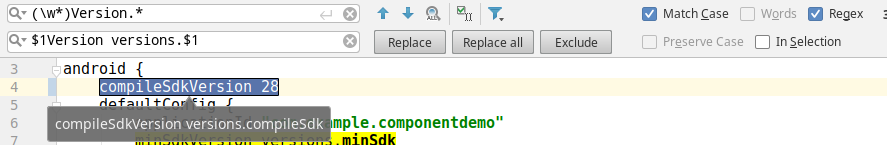
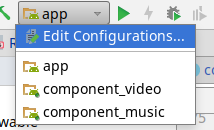

**首次同步工程失败请查看下面`应用插件`的注意事项**

按步骤提交代码, 演示Android组件化框架的配置过程
## 初始化仓库

Android Studio中创建工程. 添加android application:component_music、component_video.

## 构建脚本重构
抽取各个模块一些公共的配置到顶级build.gradle下，比如版本、依赖等
```groovy
buildscript{
    ext.versions = [
        compileSdk: 28,
        minSdk    : 15,
        targetSdk : 28,
    ]
}
```
然后到需要重构的模块/build.gradle中使用正则替换



勾选"Regex", 按需要勾选"Match Case"和"In Selection", `$1Version versions.$1`中的
`versions`部分来自`ext.versions`

依赖部分一样的方式重构.

最后顶级settings.gradle建议改用多行include的方式
```groovy
include ':app'
include ':component_video'
include ':component_music'
```
好处是可以选择多行进行注释, 编写Gradle插件时比较方便.

## 添加Gradle插件模块
新建一个java-library的模块**gradle_plugin**, 通过改`apply plugin: 'java'`为`apply plugin: 'groovy'`将
java library变成groovy工程. 加入gradle插件需要的依赖
```groovy
dependencies{
    implementation gradleApi()
    implementation localGroovy()
    //如果加了这个最好也重构到顶级构建脚本下
    implementation 'com.android.tools.build:gradle:3.2.1'
}
```

这里采用Groovy作为插件语言,将gradle_plugin/src/java重命名为groovy用来放置groovy代码
> groovy目录下当然也能添加java类, 建议按语言分类, 这种情况可以保留java目录新建groovy目录

## 插件模型

编写简单的插件模型发布到本地仓库**gradle_plugin/src/main/groovy/com/example/plugin/ComponentPlugin.groovy**
```groovy
package com.example.plugin

import org.gradle.api.Plugin
import org.gradle.api.Project

class ComponentPlugin implements Plugin<Project> {

    @Override
    void apply(Project project) {
        println "ComponentPlugin apply for $project"
    }
}
```
新建插件映射文件**gradle_plugin/src/main/resources/META-INF/gradle-plugins/com.android.component.properties**
```properties
implementation-class=com.example.plugin.ComponentPlugin
```

添加uploadArchives任务,该任务发布插件到本地maven仓库,需要引入maven插件
**gradle_plugin/build.gradle**中添加
```
apply plugin: 'maven'

uploadArchives{
    repositories.mavenDeployer{
        repository(url:uri("../repo"))
        pom.project{
            groupId = 'com.example'
            artifactId = 'componentization'
            version = '1.0'
        }
    }
}
```
groupId,artifactId,version这三个可以自由定义, 最终使用时形如:
```
dependencies{
    classpath "$groupId:$artifactId:$version"
}
```
执行`./gradlew uploadArchives`后可以看到顶级目录下生成repo
```
repo/
└── com
    └── example
        └── componentization
            ├── 1.0
            │   ├── componentization-1.0.jar
            │   ├── componentization-1.0.jar.md5
            │   ├── componentization-1.0.jar.sha1
            │   ├── componentization-1.0.pom
            │   ├── componentization-1.0.pom.md5
            │   └── componentization-1.0.pom.sha1
            ├── maven-metadata.xml
            ├── maven-metadata.xml.md5
            └── maven-metadata.xml.sha1
```

## 应用插件
这时将项目切换到Android视图,点开"Gradle Scripts"比较方便. 顶级build.gradle添加
```groovy
buildscript {
    repositories {
        maven {
            url uri('repo')
        }
    }
    dependencies {
        classpath 'com.example:componentization:1.0'
    }
}
```
在`buildscript`块中添加本地仓库的路径就是当前根项目目录下的repo, 将插件的jar包加入到构建
classpath中, 选择一个模块来应用.

**app/build.gradle**添加`apply plugin: 'com.android.component'`后
执行`./gradlew :app:tasks`看到输出:
```shell
$ ./gradlew -q :app:tasks
ComponentPlugin apply for project ':app'

------------------------------------------------------------
All tasks runnable from project :app
------------------------------------------------------------

```
创建插件并成功应用.

**注意:** 这时如果将工程推送到github上别人clone下来使用, 由于没有将插件发布到中央
仓库而本地又没有生成插件jar包, 同步肯定会失败(删掉repo目录模拟这种情况). 同步都失败了
想执行`./gradlew uploadArchives`都跑不成功又怎么去生成本地jar包呢?
1. settings.gradle中只保留插件模块
    ```groovy
    //include ':app'
    //include ':component_video'
    //include ':component_music'
    include ':gradle_plugin'
    ```
2. 顶级gradle.build中注释`classpath 'com.example:componentization:1.0'`

这样将所有可能用到目前还不存在的插件都屏蔽了, 然后去生成jar包使用.

## 组件化项目
这里不详细讨论android的组件化, 查看以下文章以了解:
 * [Android彻底组件化方案实践](https://www.jianshu.com/p/1b1d77f58e84)
 * [浅谈Android组件化](https://link.jianshu.com/?t=https%3A%2F%2Fmp.weixin.qq.com%2Fs%2FRAOjrpie214w0byRndczmg)

实现组件化需要**代码解耦**和**独立运行**, 通过配置一个`isRunningAlone`来标记. 比如music组件
```groovy
if(isRunningAlone){
    apply plugin: 'com.android.application'
}else{
    apply plugin: 'com.android.library'
}
.....
resourcePrefix "music_"
sourceSets {
    if (isRunningAlone) {
        main {
            manifest.srcFile 'src/runalone/AndroidManifest.xml'
            java.srcDirs += 'src/runalone/java'
            res.srcDirs += 'src/runalone/res'
            assets.srcDirs += 'src/runalone/assets'
            jniLibs.srcDirs += 'src/runalone/jniLibs'
        }
    }
}
```
`runalone`目录的结构和`main`完全一样, 类似于多渠道, 作为组件独立运行的代码. 而`main`中的资源和代码则
作为library添加到其他组件的依赖中. 为了代码合并是尽量避免资源冲突,每个组件配置了专属`resourcePrefix`.

`resourcePrefix "music_"`允许资源命名为music_xxx, Music_Xxx, musicXxx, MusicXxx的形式

以下是插件的配置


| 配置属性                     | 说明                                       | 例子            |
| ------------------------ | ---------------------------------------- | ------------- |
| com.example.mainmodule   | 主模块名称(需要:作前缀), 配置在顶级gradle.properties中   | :app          |
| com.example.runningalone | 是否可以独立运行, 配置在各组件的gradle.properties中      | true          |
| com.example.dependencies | 独立运行时需要的依赖(依组件时需要`:`前缀), 依赖间通过`,`分割. 配置在各组件的gradle.properties中 | :music,:video |

## 运行组件化项目
app/MainActivity中添加两个按钮, 一个跳转到music组件,一个跳转到video组件. music和video的MainActivity分别配置
Intent Action. app/gradle.properties添加依赖:
```properties
com.example.dependencies=:component_music,:component_video
```



运行app时自动添加music和video作为依赖, 并且music和video可以独立运行!

## 组件的数据传输

通过路由来进行组件之间的跳转和数据传输(可以采用ARouter等等)

## 组件生命周期

上面这些还没有涉及到各个组件的生命周期(初始化,销毁等等), 对于:app主模块来说添加一个Application的
实现类到AndroidManifest.xml中就可以了. music独立运行时也是没问题的, 但如果作为app的一个依赖, 而
合并后的AndroidManifest.xml只能有一个Application!

一种解决方案是定义公共的生命周期接口, 再通过APT编译期生成代码到指定包下, 运行时通过DexClassLoader
搜索动态执行其中的生命周期相关方法. 这种方案可以实现, 但是启动应用时需要搜索整个dex,效率上对于
一个类比较多的应用来说是不能接受的.

Android的Gradle插件1.5之后新增Gradle Transform技术, 允许对class进行转换. 因此,
另一种高效的解决方案是在编译成class文件后打包成dex之前通过动态修改class的技术将代码直接插入到
指定的地方, 运行时直接生效! 这里通过 [ASM字节码操作库](https://asm.ow2.io/asm4-guide.pdf) 来实现.

```groovy
def android = project.extensions.getByType(AppExtension)
android.registerTransform(new LifecycleTransform())
```

```java
public interface IApplication {
    void onCreate(Context context);
    void onTerminate();
    int priority();
}

public class AppLifecycleManager {

    private static final ArrayList<String> iAppNames = new ArrayList<>();
    private static final ArrayList<IApplication> iApps = new ArrayList<>();

    public static void onCreate(Context context) {
        for (IApplication app : iApps) {
            app.onCreate(context);
        }
    }

    public static void onTerminate() {
        for (IApplication app : iApps) {
            app.onTerminate();
        }
    }

    // asm字节码中调用
    private static void register(String className) {
        iAppNames.add(className);
    }

    // asm字节码中调用
    private static void init() {
        for (String name : iAppNames) {
            try {
                iApps.add(((IApplication) Class.forName(name).newInstance()));
            } catch (Exception e) {
                e.printStackTrace();
            }
        }
        Collections.sort(iApps, new Comparator<IApplication>() {
            @Override
            public int compare(IApplication o1, IApplication o2) {
                // 按优先级降序
                return o2.priority() - o1.priority();
            }
        });
    }

    /*
    // 通过asm操作字节码将生成如下的静态代码块
    static {
        register("a.b.c.IApplicationImpl");
        register("a.b.d.IApplicationImpl");
        init();
    }
    */
}
```

通过ASM搜索IApplication的实现类以及AppLifecycleManager所在的jar包, 再对AppLifecycleManager
类进行转换, 向`static{}`加入
```java
    register("a.b.c.IApplicationImpl");
    register("a.b.d.IApplicationImpl");
    init();
```

ASM框架操作字节码, 功能非常强大. 可以用于组件化、插件化、热修复、AOP等等， 由于内容丰富，这里只
提供思路，详细查看官方指南和github上的代码。

## 使用ARouter进行组件交互

详细使用查阅[alibaba/**ARouter**](https://github.com/alibaba/ARouter). 这里增加
使用kotlin的组件component_login模拟登录. 主模块点击登录传递默认的username和password
在LoginMainActivity中接收, 验证成功后结果响应主模块.

演示了生命周期组件的注册和优先级设置、组件之间完全解耦的交互、公共library的应用、
gradle插件对kotlin的支持。